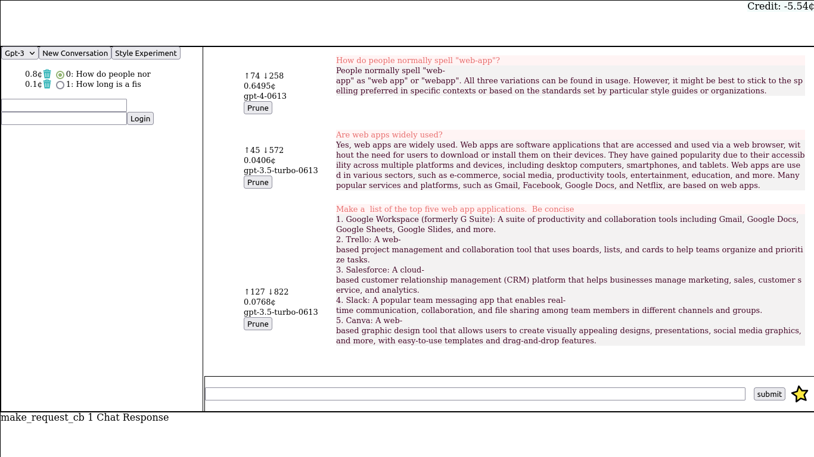

# Interact With Large Language Models

A web app for interacting with Large Language Models (LLMs). 

The only LLM this web app  works with is OpenAI, and it only implements chat, currently.

It is alpha software that I use every day.  It has many rough corners.

 

## Installing

* Install the latest rust tool chain with `rustup`.

* Clone the git repository: `git clone https://github.com/worikgh/llm-web`

* Install the Rust/Web Assembly tool chain: `cargo install wasm-pack`

### Directory Structure

```
llm-web/
├── llm-web-fe
├── llm-web-be
├── llm-web-common
├── llm-rs
```

* `llm-web-fe` is a wasm web app front end that provides an HTML5 user interface 
* `llm-web-be` is the back end that the web app talks to.  It authenticates the app, maintains user records, and proxies messages to LLMs via `llm-rs`.
* `llm-web-common` has the code for sharing between the front end and the back end.
* `llm-rs` contains the code to talk with LLM APIs.

### Build the Software

_I would like this to be: `cargo build --release` in the root but this is not yet a thing_

There are two parts to the software that need to be built separately.

1. The wasm web app loaded by the browser.  Build using the supplied script.  Change directory to  `llm-web/llm-web-fe` and run `./build.sh`.
2. The back end that manages users and proxies the queries to and responses from the LLM.  Build the back end in `llm-web/llm-web-be` with `cargo build --release`

### Serving the Web App

Install a web server.  There is an [example configuration file](lighttpd.config) for  [`lighttpd`](https://www.lighttpd.net/). It uses `env.PWD` to find configuration files, which will work OK when started from the ommand line like this

Install TLS certificates.  Web Apps will only work with HTTPS so the server that serves the Web App must serve HTTPS, and so it must have certificates.  

There are two approaches to this problem, that both wind up with documents that must be included from the web server configuration file.

1. Use a certificate from a recognised authority, like [Let's Encrypt](https://letsencrypt.org/).  This has the advantage of "just working", and not requiring adjusting browser settings.  It does require a fully qualified domain name that is registered.

2. Create a self signed certificate.  The instructions for doing this are [here](certs/README.md).  The disadvantage of doing this is that the public key must be manually installed in the browser running the web app.  This can be done using the browser's settings, or by OKing the security warnings on the first visit

Start the web server.  For lighttpd, if configured using a high port, this is as simple as: `lighttpd -f lighttpd.config`


### Configuring

* Create a file for holding user data: `touch llm-web/users.txt`

* There needs to be at least one user created.  So enter the back end' directory `llm-web/llm-web-be` and run `cargo run --release  -- add_user <username> <password>`


### Starting 

* Start up the back end by changing directory to `llm-web-be` and run `cargo run --release`

<!-- The page that hosts the web app requires serving from a web server.  The web server will proxy requests to a local server that marshals them to the LLM (OpenAI in this case).  There is a  Lighttpd (lightty) server configuration file included. -->


## The Command Line Interface `llm-rs/cli`

There is a library that exposes the various endpoints and a command line binary (`cli`) to use it

To use: `cargo run --bin cli -- --help`

```
Command line argument definitions

Usage: cli [OPTIONS]

Options:
  -m, --model <MODEL>                  The model to use [default: text-davinci-003]
  -t, --max-tokens <MAX_TOKENS>        Maximum tokens to return [default: 2000]
  -T, --temperature <TEMPERATURE>      Temperature for the model [default: 0.9]
      --api-key <API_KEY>              The secret key.  [Default: environment variable `OPENAI_API_KEY`]
  -d, --mode <MODE>                    The initial mode (API endpoint) [default: completions]
  -r, --record-file <RECORD_FILE>      The file name that prompts and replies are recorded in [default: reply.txt]
  -p, --system-prompt <SYSTEM_PROMPT>  The system prompt sent to the chat model
  -h, --help                           Print help
  -V, --version                        Print version
```


When the programme is running, enter prompts at the ">".

Generally text entered is sent to the LLM.

Text that starts with "! " is a command to the system.  


### List of Meta Commands

Meta commands that effect the performance of the programme are prefixed with a `!` character, and are:

|Command| Result|
|:---|:---|
|! p|  Display settings|
|! md| Display all models available available|
|! ms| <model> Change the current model|
|! ml| List modes  <mode> Change mode (API endpoint)|
|! v | Set verbosity|
|! k | Set max tokens for completions|
|! t | Set temperature for completions|
|! sp| Set system prompt (after `! cc`|
|! ci| Clear image mask <path> Set the mask to use in image edit mode.  A 1024x1024 PNG with transparent mask|
|! a |<path> Audio file for transcription|
|! ci| Clear the image stored for editing|
|! f |List the files stored on the server|
|! fu| <path> Upload a file of fine tuning data|
|! fd| <file id> Delete a file|
|! fi| <file id> Get information about file|
|! fc| <file id> [destination_file] Get contents of file|
|! fl| <name> <path>  Associate the contents of the `path` with `name` for use in prompts like: {name}|
|! dx| Display context (for chat)|
|! cx| Clear context|
|! sx| <path>  Save the context to a file at the specified path|
|! rx| <path>  Restore the context from a file at the specified path|
|! ? | This text|


C-q or C-c to quit.

### Features

* **Save and restore the context of a chat**  `! sx <path>`, `! rx <path>`  Does not save the system prompt, yet.
* **Include file content in prompt** `! fl <name> <path>`  Then "Summarise {name}"
* **Display the cost of a chat session** It is in US cents, and an over estimate.
* **Command History** Courtesy of [rustyline](https://crates.io/crates/rustyline)

## Modes

The LLMs can be used in different modes.  Each mode corresponds to an API endpoint.

The meaning of the prompts change with the mode.

### Completions

* Each prompt is independent
* Temperature is very important.
* The maximum tokens influences how long the reply will be

### Chat

* Prompts are considered in a conversation.
* When switching to chat mode supply the "system" prompt.  It a message that is at the start of the conversation with `role` set to "system".  It defines the characteristics of the machine.  Some examples:
  * You are a grumpy curmudgeon
  * You are an expert in physics.  Very good at explaining mathematical equations in basic terms
  * You answer all queries in rhyme
.

### Image and Image Edit

Generate or edit images based on a prompt.


Enter Image mode with the meta command: `! m image [image to edit]`.  If you provide an image to edit "ImageEdit" mode is entered instead, and the supplied image is edited.

If an image is not supplied (at `! m image` prompt) the user enters a prompt and an image is generated by OpenAI based n that prompt.  It is stored for image edit.  Generating a new image over writes the old one.  

**Mask**  To edit an image the process works best if a mask is supplied.  This is a 1024x1024 PNG image with a transparent region.  The editing will happen in the transparent region.  There are two ways to supply a mask: when entering image edit, or with a meta command

1. **Entering Image Edit** Supply the path to the meta command switching to Image Edit: `! m image_edit path_to/mask.png`
2. **Using the `mask` Meta Command** The mask can be set or changed at any time using the meta command: `! mask path/to_mask.png`

If no mask is supplied a 1024x1024 transparent PNG file is created and used. 
>>>>>>> llm-rs/mistress

